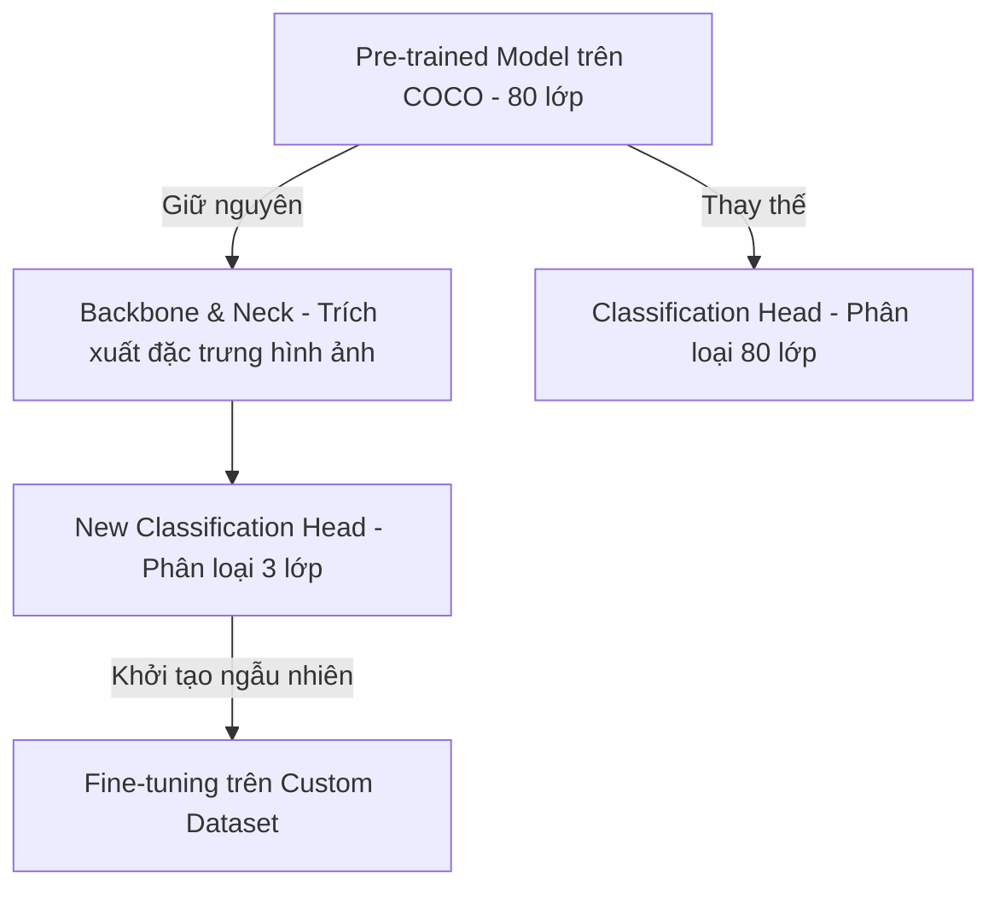

# Tài liệu Dữ liệu (Datasets Documentation)

Tài liệu này mô tả chi tiết về các tập dữ liệu (datasets) được sử dụng trong dự án **Hệ thống phát hiện & phân loại phương tiện giao thông trên video** qua các Phase phát triển.

---

## 1. Tổng quan các thuộc tính cần phát hiện (Target Features)
Hệ thống tập trung vào việc phát hiện và phân loại **3 nhóm đối tượng chính** đại diện cho giao thông đường bộ:
- **Car (Ô tô):** Các loại ô tô con, ô tô 4-7 chỗ, taxi.
- **Motorcycle (Xe máy):** Xe máy, xe hai bánh gắn máy (đây là phương tiện chiếm tỉ trọng lớn nhất trong giao thông Việt Nam).
- **Truck (Xe tải):** Xe tải chở hàng, xe container, xe ben.

---

## 2. Dataset Phase 1: MS COCO (Pre-trained Base)
Trong Phase 1 (Base), chúng ta sử dụng trọng số được huấn luyện sẵn (pre-trained weights) trên tập dữ liệu **MS COCO (Microsoft Common Objects in Context)**.

### Thông số kỹ thuật của COCO:
- **Tổng số ảnh:** ~330,000 ảnh (trong đó có hơn 200,000 ảnh được gán nhãn).
- **Số lớp đối tượng (Labels):** 80 lớp đối tượng đa dạng từ đời sống hàng ngày (người, động vật, phương tiện, đồ gia dụng...).
- **Vị trí chỉ mục (Class Index) của 3 lớp cần dùng:**
  - `Index 2`: **car**
  - `Index 3`: **motorcycle**
  - `Index 7`: **truck**
- **Định dạng nhãn gốc:** COCO format (Bounding box dạng `[x_min, y_min, width, height]` tính bằng pixel).

### Đánh giá khi chạy Baseline (Phase 1):
- Khi chạy model pre-trained trên video giao thông Đà Nẵng, chúng ta sẽ lọc (filter) kết quả nhận diện, chỉ vẽ khung và tính toán cho 3 Class Index `[2, 3, 7]` nêu trên.
- Do COCO được chụp từ nhiều góc độ chụp ảnh đời sống thông thường, độ chính xác khi áp dụng vào camera giao thông góc nhìn cao (CCTV) tại Việt Nam thường bị giảm sút, đặc biệt là hiện tượng trùng lặp và bỏ sót xe máy khi đi mật độ dày.

---

## 3. Dataset Phase 2: Custom Traffic Dataset (Fine-tuning)
Trong Phase 2, để mô hình nhận diện tốt nhất đặc điểm giao thông tại Việt Nam, chúng ta sử dụng tập dữ liệu giao thông Việt Nam thực tế được tải về từ Roboflow Universe.

### Thông số cấu trúc Dataset thực tế (Vietnamese Vehicle Dataset):
- **Tổng số lượng ảnh:** 1,547 ảnh thực tế đường phố Việt Nam.
- **Phân chia dữ liệu thực tế (Data Split):**
  - **Train set (Huấn luyện):** 1,235 ảnh (80%) - Dùng để tối ưu hóa trọng số mô hình.
  - **Validation set (Đánh giá):** 219 ảnh (14%) - Dùng để tính toán các chỉ số mAP và loss.
  - **Test set (Kiểm thử):** 93 ảnh (6%) - Dùng để đánh giá mô hình cuối cùng độc lập.

### Cấu trúc nhãn (Class Mapping):
Tập dữ liệu gốc định nghĩa nhãn thô dưới dạng số `['0', '1', '2', '3']`. Bằng phương pháp so khớp bounding box thông minh (IoU Matcher) với mô hình pre-trained COCO, chúng ta đã giải mã thành công bản đồ nhãn như sau:
- **Lớp 0 (`car`):** Xe ô tô con, xe du lịch.
- **Lớp 1 (`motor`):** Xe máy, xe mô tô 2 bánh.
- **Lớp 2 (`truck`):** Xe tải (YOLO COCO thường nhận nhầm lớp này là `bus` do hình dáng hộp đặc thù của xe tải Việt Nam, nhưng bản chất nhãn là `truck`).
- **Lớp 3 (`bus`):** Xe buýt công cộng, xe khách lớn.

Cấu hình nhãn trong file [configs/traffic.yaml](file:///d:/HK8/DL/configs/traffic.yaml) của dự án:
```yaml
nc: 4
names:
  0: car
  1: motor
  2: truck
  3: bus
```

### Định dạng nhãn (Labels & Features):
- Sử dụng định dạng **YOLO format** (.txt cho mỗi ảnh).
- Mỗi dòng trong file nhãn là một đối tượng, gồm 5 trường thông tin:
  `<class_id> <x_center> <y_center> <width> <height>`
  *Trong đó các giá trị tọa độ đều được chuẩn hóa (normalized) trong khoảng `[0, 1]` tương ứng với chiều rộng và chiều cao của ảnh.*

---

## 4. Cơ chế huấn luyện chuyển dịch từ Phase 1 sang Phase 2 (Transfer Learning)

Khi thực hiện chuyển đổi từ việc sử dụng mô hình pre-trained (COCO - 80 lớp) sang mô hình fine-tuned (Custom - 3 lớp), hệ thống sẽ hoạt động theo cơ chế **Transfer Learning**:



### Cách hoạt động cụ thể:
1. **Thay thế lớp đầu ra (Classification Head):** Lớp cuối cùng chịu trách nhiệm dự đoán xác suất của 80 class trong COCO sẽ bị loại bỏ. Một lớp mới với 3 đầu ra (`car`, `motorcycle`, `truck`) sẽ được tạo ra và khởi tạo ngẫu nhiên.
2. **Kế thừa bộ trích xuất đặc trưng (Backbone & Neck):** Các tầng mạng trước đó đã học được cách nhận diện các cấu trúc hình học cơ bản (cạnh, đường cong, hình tròn của bánh xe, hình chữ nhật của kính xe...). Những trọng số này được giữ lại để huấn luyện tiếp thay vì học lại từ đầu.
3. **Quá trình Fine-tuning:**
   - Trong quá trình train trên dataset mới, mô hình sẽ tinh chỉnh nhẹ các trọng số ở Backbone/Neck và tối ưu mạnh các trọng số ở Classification Head mới để tối đa hóa độ chính xác trên tập ảnh giao thông thực tế.

---

## 5. Các câu hỏi thực tế về Dataset & Huấn luyện

### 5.1. Dataset ở Phase 2 có đảm bảo đủ 3 nhãn (Car, Motorcycle, Truck)?
- **Đảm bảo:** Khi lựa chọn hoặc xây dựng dataset cho Phase 2, chúng ta sẽ kiểm tra cấu hình nhãn (class names) để chắc chắn chỉ tải về/sử dụng các ảnh có chứa 3 nhãn này.
- Các tập dữ liệu giao thông đô thị phổ biến (như các tập Vietnamese Traffic trên Roboflow) đều được gắn nhãn đầy đủ cho 3 phương tiện chính này vì đây là các phương tiện cơ bản nhất trên đường phố.

### 5.2. Sự phân bố giữa 3 nhãn có đồng đều không và cách xử lý?
- **Thực tế:** Trong giao thông thực tế (đặc biệt là tại Việt Nam), phân bố nhãn **không bao giờ đồng đều**. Số lượng xe máy luôn chiếm tỷ lệ áp đảo (~70-80%), tiếp theo là ô tô con (car), và thấp nhất là xe tải (truck) do xe tải thường bị hạn chế đi vào nội đô theo khung giờ.
- **Cách xử lý mất cân bằng dữ liệu (Data Imbalance):**
  1. **Data Augmentation nâng cao:** Sử dụng kỹ thuật *Mosaic* (ghép 4 ảnh ngẫu nhiên thành 1 ảnh mới) và *Mixup* trong YOLOv8 để tăng tần suất xuất hiện và đa dạng hóa các bối cảnh của xe tải.
  2. **Class Weights (Trọng số lớp):** Cấu hình hàm Loss phạt nặng hơn khi mô hình dự đoán sai các lớp thiểu số (như xe tải), giúp mô hình tập trung học các lớp ít xuất hiện hơn.
  3. **Lọc dữ liệu đầu vào:** Khi chọn dataset, chúng ta sẽ ưu tiên các tập dữ liệu có bổ sung ảnh giao thông ngoại thành hoặc các khung giờ xe tải được phép hoạt động để tăng lượng mẫu cho lớp `truck`.

### 5.3. Số lượng ảnh ít (~1,500 ảnh) thì model hoạt động có tốt không?
- **Hoạt động rất tốt.** Nếu huấn luyện từ đầu (train from scratch) với trọng số ngẫu nhiên, 1,500 ảnh chắc chắn sẽ dẫn đến hiện tượng **Overfitting** (mô hình chỉ thuộc lòng tập train mà không nhận diện được ảnh mới).
- Tuy nhiên, ở đây chúng ta dùng **Transfer Learning (Học chuyển tiếp)** từ pre-trained weights của COCO (đã học qua hơn 118,000 ảnh):
  - Mô hình đã có sẵn khả năng nhận dạng các đặc trưng hình học căn bản (cạnh, góc, bánh xe, mặt kính, màu sắc).
  - Khoảng 1,500 ảnh custom chỉ đóng vai trò **"dạy"** cho mô hình cách áp dụng các đặc trưng đã biết đó vào góc nhìn camera giao thông mới, nhận diện kiểu dáng xe máy Việt Nam hoặc xe tải địa phương.
  - Trong thực tế công nghiệp, việc fine-tune YOLO trên các tập dữ liệu từ 1,000 đến 2,000 ảnh mang lại độ chính xác rất cao (mAP@0.5 đạt từ 85% - 95%) đối với góc cam cố định.

