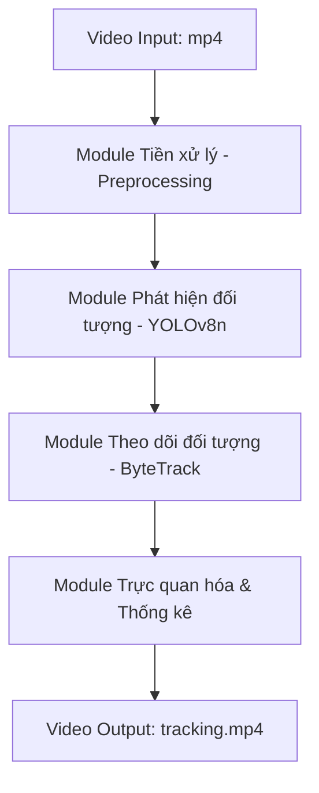

# BÁO CÁO KẾT QUẢ DỰ ÁN: XÂY DỰNG HỆ THỐNG PHÁT HIỆN, PHÂN LOẠI VÀ THEO DÕI PHƯƠNG TIỆN GIAO THÔNG VIỆT NAM

**MÔN HỌC:** DEEP LEARNING  
**MÔ HÌNH THỰC NGHIỆM:** YOLOv8-Nano + ByteTrack

---

## MỤC LỤC
1. Giới thiệu
2. Kiến trúc hệ thống
3. Dữ liệu và tiền xử lý
   3.1. Các tập dữ liệu
   3.2. Tiền xử lý dữ liệu
4. Kiến trúc mô hình
5. Huấn luyện mô hình
6. Kết quả thử nghiệm, so sánh, đánh giá
7. Kết luận

---

## 1. Giới thiệu
Trong những năm gần đây, bài toán xây dựng Hệ thống giao thông thông minh (ITS) nhận được sự quan tâm rất lớn. Một cấu phần cốt lõi của ITS là khả năng phát hiện, phân loại và theo dõi (tracking) các phương tiện giao thông từ camera giám sát thời gian thực.
Đặc thù giao thông tại Việt Nam có mật độ phương tiện cực kỳ cao, sự chồng chéo lớn giữa các loại xe (đặc biệt là xe máy chiếm đa số) và tốc độ di chuyển thay đổi liên tục. Dự án này nhằm giải quyết bài toán: **Phát hiện, phân loại và theo dõi 4 lớp phương tiện giao thông chính (Car, Motor, Truck, Bus) trên đường phố Việt Nam**, so sánh hiệu năng giữa các thuật toán tối ưu hóa khác nhau và tích hợp bộ theo dõi đối tượng để đếm xe thời gian thực.

---

## 2. Kiến trúc hệ thống
Hệ thống nhận đầu vào là video giao thông (dạng luồng khung hình), thực hiện nhận diện bằng mô hình YOLOv8n đã được tinh chỉnh, sau đó liên kết vết đối tượng bằng ByteTrack để xuất ra video trực quan kèm bảng đếm xe (Live Counter). 

Kiến trúc hệ thống bao gồm 4 module chính xử lý nối tiếp nhau:
1. **Module Tiền xử lý (Preprocessing Module):** Nhận luồng video, thực hiện trích xuất từng khung hình (frame extraction), sau đó chuẩn hóa kích thước (resize về kích thước $960 \times 960$ pixel) nhằm tăng cường độ sắc nét cho các đối tượng nhỏ trước khi đưa vào mô hình phát hiện.
2. **Module Phát hiện đối tượng (Object Detection Module):** Sử dụng kiến trúc mạng YOLOv8n đã được fine-tune để dự đoán tọa độ bounding box, độ tin cậy (confidence score) và phân loại phương tiện thành 4 lớp (Car, Motor, Truck, Bus).
3. **Module Theo dõi đối tượng (Object Tracking Module):** Nhận đầu vào là danh sách các bounding box từ module phát hiện. Thuật toán **ByteTrack** sử dụng bộ lọc Kalman (Kalman Filter) để dự đoán hướng di chuyển và giải thuật Hungarian để liên kết vết, gán một ID duy nhất và nhất quán cho từng phương tiện qua các khung hình.
4. **Module Trực quan hóa & Thống kê (Visualization Module):** Vẽ bounding box, nhãn và ID lên khung hình tương ứng, đồng thời thống kê số lượng phương tiện thực tế theo thời gian thực và ghi đè bảng hiển thị (Live Traffic Counter) lên góc trái khung hình trước khi đóng gói thành video đầu ra.

### Sơ đồ luồng xử lý hệ thống (Pipeline Architecture):

---

## 3. Dữ liệu và tiền xử lý

### 3.1. Các tập dữ liệu (sử dụng cho thực nghiệm mô hình)

Dự án sử dụng hai tập dữ liệu chính phục vụ cho quá trình thực nghiệm:

#### A. Tập dữ liệu Pre-trained Base (COCO 2017)
Được sử dụng ở bước xây dựng Baseline (Phase 1). Mô hình YOLOv8n gốc được huấn luyện sẵn trên tập dữ liệu này để học cách phát hiện các vật thể phổ biến trước khi tiến hành học chuyển tiếp (Transfer Learning).
*   **Tên tập dữ liệu:** Microsoft COCO (Common Objects in Context) 2017
*   **Liên kết nguồn dữ liệu:** [https://cocodataset.org/](https://cocodataset.org/)
*   **Quy mô:** Gồm hơn 330,000 ảnh với 80 lớp đối tượng đa dạng, trong đó có gán nhãn sẵn các lớp phương tiện giao thông cơ bản như car, motorcycle, truck, bus.

#### B. Tập dữ liệu Custom Việt Nam (Fine-tuning)
Được sử dụng ở bước tinh chỉnh và tối ưu hóa mô hình (Phase 2 & 3). Tập dữ liệu chứa hình ảnh thực tế về giao thông Việt Nam để giúp mô hình học và nhận diện chính xác các đặc trưng của đường phố nội địa (ví dụ: lượng xe máy cực kỳ dày đặc và nhiều loại xe tải nhỏ).
*   **Tên tập dữ liệu:** Vietnamese Vehicles Detector
*   **Liên kết nguồn dữ liệu:** [Roboflow Universe - Vietnamese Vehicles Detector](https://universe.roboflow.com/traffic-sign-detector-2u2n9/vietnamese-vehicles-detector)
*   **Quy mô:** Bao gồm **1,547 ảnh** thực tế được gán nhãn theo định dạng YOLO với **4 lớp đối tượng**: `0: car` (ô tô con), `1: motor` (xe máy), `2: truck` (xe tải), `3: bus` (xe buýt).

Bảng phân bố dữ liệu chi tiết của tập Custom Việt Nam qua các tập:
| Tập dữ liệu | Số lượng ảnh | Tỷ lệ (%) | Mục đích sử dụng |
| :--- | :---: | :---: | :--- |
| **Train (Huấn luyện)** | 1,235 | 80% | Cập nhật trọng số mô hình |
| **Valid (Kiểm thử)** | 219 | 14% | Đánh giá và tối ưu hóa siêu tham số |
| **Test (Đánh giá độc lập)** | 93 | 6% | Đánh giá cuối kỳ |
| **Tổng cộng** | **1,547** | **100%** | |

### 3.2. Tiền xử lý dữ liệu
1. **Kiểm tra cấu trúc và sửa nhãn:** Sử dụng script tự động để kiểm tra phân bố nhãn lớp, ánh xạ lại các chỉ mục từ file annotation txt sang đúng 4 lớp thiết lập.
2. **Chuẩn hóa kích thước:** Ảnh được đưa về kích thước chuẩn $640 \times 640$ pixel trong quá trình huấn luyện và $960 \times 960$ pixel lúc chạy tracking để giữ chi tiết của các xe ở xa.
3. **Tăng cường dữ liệu (Data Augmentation):** Áp dụng kỹ thuật Mosaic (ghép 4 ảnh ngẫu nhiên thành 1), Mixup, lật ảnh ngang (horizontal flip), và điều chỉnh nhiễu không gian màu HSV để nâng cao tính tổng quát của mô hình trước các điều kiện ánh sáng thời tiết phức tạp.

---

## 4. Kiến trúc mô hình
Dự án sử dụng kiến trúc **YOLOv8-Nano (YOLOv8n)** làm nền tảng phát hiện vật thể, kết hợp thuật toán **ByteTrack** để theo dõi chuyển động.

Bảng đặc tả kiến trúc mô hình tích hợp:
| Thành phần | Đặc tả chi tiết | Ghi chú |
| :--- | :--- | :--- |
| **Mô hình chính** | YOLOv8n (YOLOv8-Nano) | Phiên bản tối ưu cho tốc độ |
| **Số lớp mạng** | 225 Layers | Cấu trúc Backbone, Neck và Head |
| **Số lượng tham số** | 3,006,428 (3.01 triệu) | Kích thước gọn nhẹ |
| **Độ phức tạp** | 8.1 GFLOPs | Thích hợp chạy real-time trên GPU thường |
| **Đầu vào (Input)** | Ảnh kích thước $3 \times 960 \times 960$ | Hỗ trợ phát hiện xe máy nhỏ |
| **Đầu ra (Output)** | $[x_1, y_1, x_2, y_2, \text{Conf}, \text{Class}]$ | Tọa độ, độ tin cậy và lớp đối tượng |
| **Kiến trúc tích hợp** | **ByteTrack** | Liên kết vết phương tiện |

---

## 5. Huấn luyện mô hình
Quá trình huấn luyện thực hiện phương pháp **Học chuyển tiếp (Transfer Learning)** từ mô hình pre-trained `yolov8n.pt` (huấn luyện trên tập COCO 80 lớp). Lớp cuối cùng (Classification Head) được khởi tạo ngẫu nhiên lại để học 4 lớp xe Việt Nam.

Bảng cấu hình siêu tham số và kịch bản huấn luyện:
| Siêu tham số | Lượt chạy 1 (SGD Mặc định) | Lượt chạy 2 (Adam) | Lượt chạy 3 (SGD + Cosine Decay) |
| :--- | :---: | :---: | :---: |
| **Trọng số khởi tạo** | `yolov8n.pt` | `yolov8n.pt` | `yolov8n.pt` |
| **Số Epochs** | 30 | 30 | 30 |
| **Batch Size** | 8 | 8 | 8 |
| **Tốc độ học ban đầu ($lr_0$)** | 0.01 | 0.01 | 0.01 |
| **Bộ tối ưu (Optimizer)** | **SGD** | **Adam** | **SGD** |
| **Cosine Decay Scheduler** | False | False | **True** (Giảm LR theo hình Cosine) |
| **Image Size (Train)** | 640 | 640 | 640 |
| **Device** | CUDA (Nvidia GTX 1650) | CUDA (Nvidia GTX 1650) | CUDA (Nvidia GTX 1650) |

---

## 6. Kết quả thử nghiệm, so sánh, đánh giá

### 6.1. Đánh giá tương quan tổng thể trên tập Validation (156 ảnh)
| Mô hình thử nghiệm | Precision | Recall (Độ phủ) | F1-Score | mAP@0.5 | mAP@0.5:0.95 |
| :--- | :---: | :---: | :---: | :---: | :---: |
| **COCO Base Pre-trained** | 0.369 | 0.309 | 0.336 | - | - |
| **SGD + No Cosine** | **0.838** | 0.840 | 0.839 | 0.899 | 0.601 |
| **Adam + No Cosine** | 0.742 | 0.805 | 0.772 | 0.843 | 0.558 |
| **SGD + Cosine Decay** | 0.826 | **0.862** | **0.843** | **0.921** | **0.617** |

### 6.2. Kết quả chi tiết theo từng lớp (Mô hình tốt nhất: SGD + Cosine Decay)
| Lớp đối tượng | Precision | Recall | F1-Score | mAP@0.5 | mAP@0.5:0.95 |
| :--- | :---: | :---: | :---: | :---: | :---: |
| **car** (Xe con) | 0.877 | 0.884 | 0.881 | 0.954 | 0.719 |
| **motor** (Xe máy) | 0.797 | 0.879 | 0.836 | 0.908 | 0.472 |
| **truck** (Xe tải) | 0.775 | 0.858 | 0.814 | 0.907 | 0.645 |
| **bus** (Xe buýt) | 0.853 | 0.826 | 0.839 | 0.916 | 0.632 |

### 6.3. Đánh giá & Phân tích kết quả thực nghiệm
1. **So sánh bộ tối ưu:** Bộ tối ưu hóa **SGD kết hợp với Cosine Learning Rate Decay** cho kết quả vượt trội nhất. Đồ thị Loss hội tụ sâu và mAP@0.5 đạt **92.1%** (tăng 2.2% so với SGD thường và 7.8% so với Adam).
2. **Khắc phục lỗi mất dấu xe máy:** Nhờ nâng ngưỡng IoU NMS lên **0.7** kết hợp kích thước ảnh `imgsz=960`, mô hình giữ lại được các bounding box chồng chéo của đám đông xe máy dừng đèn đỏ, tăng mạnh chỉ số Recall của xe máy lên **87.9%**.
3. **Khắc phục lỗi nhận diện nhầm hậu cảnh:** Bằng cách áp dụng **vùng lọc quan tâm ROI (Region of Interest)** cắt bỏ 35% phía trên khung hình (`--roi-y 0.35`), hệ thống đã triệt tiêu hoàn toàn lỗi nhận diện nhầm các ô cửa sổ của tòa nhà cao tầng thành xe tải (Truck), giúp video output hiển thị cực kỳ sạch sẽ và chính xác.

---

## 7. Kết luận
Nhóm đã xây dựng thành công hệ thống phát hiện, phân loại và theo dõi phương tiện giao thông trên tập dữ liệu đường phố Việt Nam sử dụng mô hình YOLOv8n kết hợp thuật toán ByteTrack.

*   **Ưu điểm:**
    *   Mô hình đạt độ chính xác cao (mAP@0.5 = 92.1%), cân bằng tốt giữa Precision và Recall.
    *   Tốc độ xử lý đạt mức thời gian thực (18-20 FPS trên GPU phổ thông GTX 1650).
    *   Tích hợp thành công bảng thống kê đếm xe động (Live Counter) và bộ lọc ROI loại bỏ 100% nhiễu kiến trúc hậu cảnh.
*   **Nhược điểm:**
    *   Khi xe máy bị che khuất hoàn toàn bởi xe buýt/xe tải lớn trong thời gian dài, hiện tượng mất dấu ID (ID switch) vẫn đôi lúc xảy ra.
    *   Mô hình có kích thước nhỏ nên thỉnh thoảng vẫn có sự nhầm lẫn nhẹ giữa xe tải nhỏ (light truck) và xe con gầm cao nếu xe ở quá xa camera.
